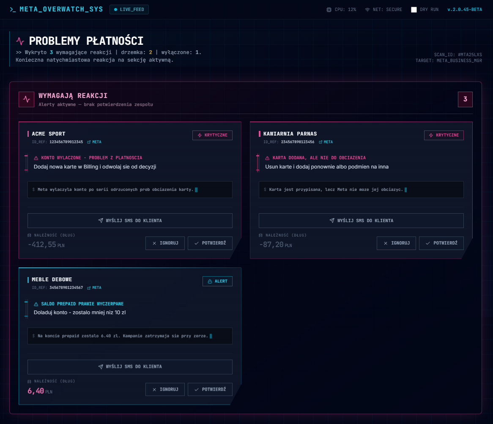
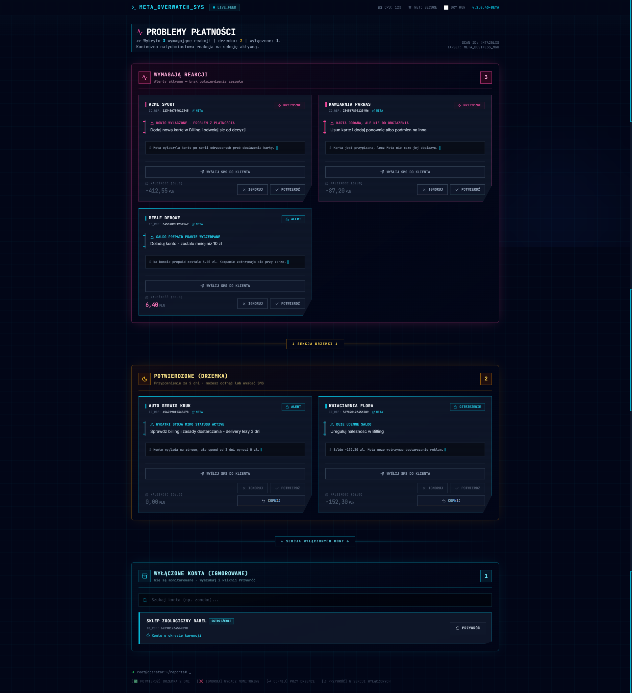
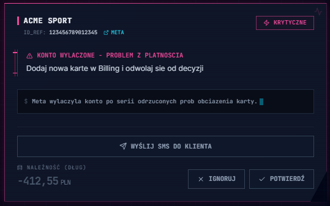
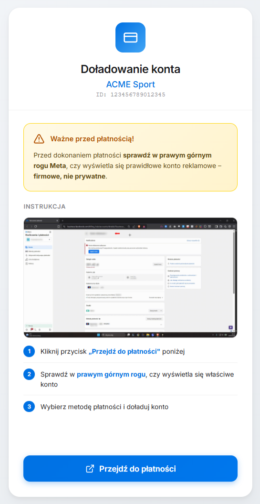
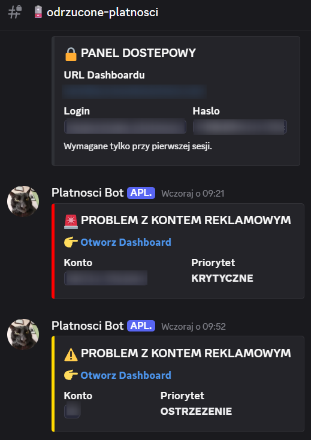
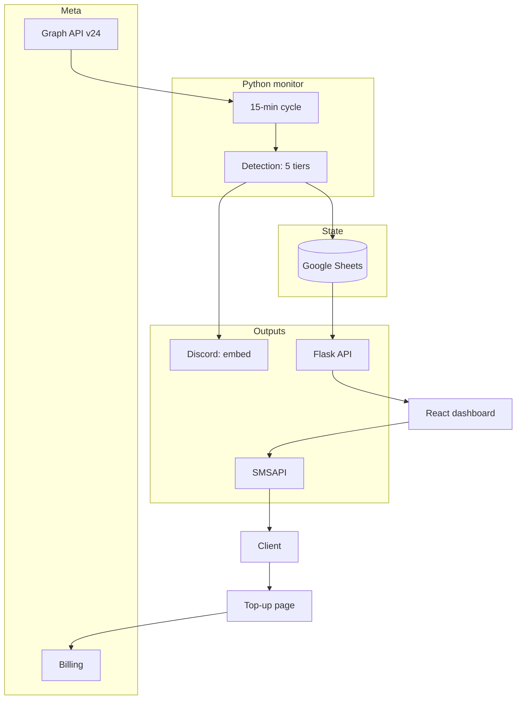

<p align="center"></p>

<h1 align="center">Meta Ads Payment Monitor</h1>

<h3 align="center">Catches rejected cards, account blocks and silent delivery stops across 100+ ad accounts before campaigns die. Discord alerts, state in a spreadsheet, SMS to the client.</h3>

<p align="center">
  
  
  
  
  
  
</p>

---

## Table of contents

- [About](#about)
- [Screenshots](#screenshots)
- [Source code](#source-code)
- [Stack](#stack)
- [Features](#features)
- [Architecture](#architecture)
- [Statistics](#statistics)
- [Contact](#contact)

---

## About

The agency runs over a hundred Meta Ads accounts: its own and its clients'. A rejected card, an account block or a silent delivery stop means dead campaigns nobody notices until the invoice. Checking a hundred accounts by hand in Business Manager is not an option.

Every 15 minutes during working hours the monitor queries the Meta Graph API for all accounts and pushes them through five detection tiers: from a disabled account, through a missing payment method and an exhausted prepaid balance, to an account formally ACTIVE whose spend stopped three days ago. A problem lands as a Discord embed, state lives in a Google Sheet, and the team manages alerts from a dashboard: acknowledge, snooze or disable. A client with an empty account gets an SMS with a link to a top-up page.

In production since November 2025. I rewrote it from n8n to Python and replaced ClickUp with Discord and a custom dashboard. After a notification flood incident I added safeguards: retry with cache, a send block when the spreadsheet degrades and a fuse at five alerts per cycle.

---

## Screenshots

| Dashboard with alert cards | Alert card with actions |
|:---:|:---:|
|  |  |

| Client top-up page | Discord embed |
|:---:|:---:|
|  |  |

> **Note:** the dashboard and SMS page show fictional accounts from a local stub. The embed comes from production, account names are blurred.

---

## Source code

The code is private and confidential (an internal agency system). This repository documents the project: description, architecture and working screenshots.

---

## Stack

### Monitor (Python 3.11)

```
Meta Graph API v24            // owned + client accounts, Batch insights (14-day spend)
schedule + Flask 3            // 15-min cycle (8-22), API for the dashboard
Google Sheets (gspread)       // alert state, SMS contacts, retry with cache
```

### Alerts and SMS

```
Discord webhooks              // embed with priority and dashboard link
SMSAPI                        // SMS to the client with a top-up link
Netlify                       // intermediate /p/* page with CTA to Meta Billing
SMTP2GO                       // e-mail alert when the monitor goes silent
```

### Dashboard

```
React 19 + Vite 6 + TS        // alert cards, three sections, 30 s polling
Tailwind                      // dark cyber/terminal style
Netlify                       // hosting + /api proxy to the backend
```

### Operations

```
Docker Compose on a VPS       // single service, healthcheck on /health
pull-deploy.sh                // git pull + compose up on the server
```

---

## Features

### Problem detection (5 tiers)

- **Account disabled** - DISABLED with a reason: payment, integrity, compromise; plus PENDING_RISK_REVIEW and PENDING_CLOSURE
- **Settlement** - PENDING_SETTLEMENT and IN_GRACE_PERIOD as a separate priority
- **Payment method** - no card, card added but not chargeable, closed payment method
- **Balance** - large negative balance; for prepaid a parser reads Meta's `display_string` (handles even the non-breaking space in the amount)
- **Spend gap** - account ACTIVE but spend flat for 3 days against a spending history; Meta does not report this and campaigns are effectively dead

### Alerts and state

- **Discord embed** - priority color, problem teaser, dashboard link; sorted by severity
- **Google Sheet as the database** - new / acknowledged / ignored statuses, meta rows with timestamps
- **Snooze and reminders** - an acknowledged alert returns after 2 days if the problem persists; a reminder for new ones after 24 h
- **Safeguards** - retry with cache on Sheets failures, zero sends during degradation, state persisted before the webhook, a fuse at 5 new alerts per cycle

### SMS to the client

- **Button on the card** - the operator decides, the monitor never sends on its own
- **Top-up link** - SMS with the account slug, an intermediate page walks the client to the right Meta Billing
- **Self-filling contact sheet** - a missing number at send time auto-adds the contact and opens the spreadsheet

### Dashboard

- **Three sections** - needs action, acknowledged (snoozed), disabled with search and restore
- **Alert card** - problem, explanation, balance in PLN, Meta Billing link, actions: Acknowledge / Ignore / Undo / SMS
- **Polling every 30 s** - the dashboard refreshes alerts on its own
- **DRY RUN** - detection preview against the live Meta API without writes, available only off production

### Operations

- **Working hours** - detection cycle 8:00-22:00, healthcheck 24/7
- **E-mail alert** - when the monitor stays silent past the timeout, an e-mail with a 24 h cooldown
- **Deploy** - pull-deploy on the VPS over SSH

---

## Architecture



---

## Statistics

### Technical complexity

| Metric | Value |
|---|---|
| **Commits** | 74 (2025-11 - 2026-07) |
| **Authors** | 1 |
| **Lines of code** | ~4,760 (3,198 Python + 1,136 dashboard + 430 SMS page) |
| **HTTP endpoints** | 6 |
| **Detection tiers** | 5 |
| **Monitored accounts** | 100+ (owned + client) |
| **Services** | 3 (bot on Docker, dashboard and SMS page on Netlify) |

### Feature overview

| Category | Highlights |
|---|---|
| **Detection** | 5 tiers, prepaid parser, spend gap |
| **Alerts** | Discord, snooze, reminders, anti-spam safeguards |
| **SMS** | operator button, top-up page, auto-contacts |
| **Operations** | working hours, 24/7 healthcheck, pull-deploy |

---

## Contact

| Platform | Link |
|---|---|
| **WWW** | [kamilkaczmareksolutions.com](https://kamilkaczmareksolutions.com) |
| **GitHub** | [kamilkaczmareksolutions](https://github.com/kamilkaczmareksolutions) |
| **LinkedIn** | [Kamil Kaczmarek](https://www.linkedin.com/in/kamilkaczmareksolutions) |
| **Email** | [recruitment@kamilkaczmareksolutions.com](mailto:recruitment@kamilkaczmareksolutions.com) |

---

**Meta Ads Payment Monitor** - no campaign dies silently.

<p align="center"><em>Built by Kamil Kaczmarek</em></p>
