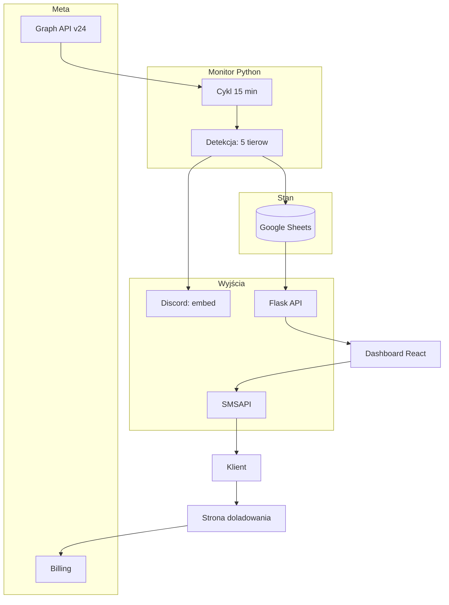

<p align="center"></p>

<h1 align="center">Monitor Płatności Meta Ads</h1>

<h3 align="center">Wykrywa odrzucone karty, blokady i ciche zatrzymanie delivery na 100+ kontach reklamowych, zanim kampanie umrą. Alert na Discordzie, stan w arkuszu, SMS do klienta.</h3>

<p align="center">
  
  
  
  
  
  
</p>

---

## Spis treści

- [O projekcie](#o-projekcie)
- [Screenshoty](#screenshoty)
- [Kod źródłowy](#kod-źródłowy)
- [Stack](#stack)
- [Funkcje](#funkcje)
- [Architektura](#architektura)
- [Statystyki](#statystyki)
- [Kontakt](#kontakt)

---

## O projekcie

Agencja obsługuje ponad sto kont reklamowych Meta Ads: własnych i klientów. Odrzucona karta, blokada konta albo ciche zatrzymanie delivery oznacza martwe kampanie, których nikt nie widzi do faktury. Ręczne sprawdzanie stu kont w Business Managerze nie wchodzi w grę.

Co 15 minut w godzinach pracy monitor odpytuje Meta Graph API o wszystkie konta i przepuszcza je przez pięć tierów detekcji: od wyłączonego konta, przez brak metody płatności i wyczerpane saldo prepaid, po konto formalnie ACTIVE, na którym wydatki stanęły trzy dni temu. Problem ląduje jako embed na Discordzie, stan trzyma arkusz Google, a zespół zarządza alertami z dashboardu: potwierdza, odkłada albo wyłącza. Klient z pustym kontem dostaje SMS-a z linkiem do strony doładowania.

System działa na produkcji od listopada 2025. Przepisałem go z n8n na Pythona, a ClickUp zastąpiłem Discordem i własnym dashboardem. Po incydencie z lawiną powiadomień dodałem bezpieczniki: retry z cache, blokadę wysyłki przy degradacji arkusza i bezpiecznik na pięć alertów w cyklu.

---

## Screenshoty

| Dashboard z kartami alertów | Karta alertu z akcjami |
|:---:|:---:|
|  |  |

| Strona doładowania dla klienta | Embed na Discordzie |
|:---:|:---:|
|  |  |

> **Nota:** dashboard i strona SMS pokazują fikcyjne konta z lokalnego stuba. Embed pochodzi z produkcji, nazwy kont są zamazane.

---

## Kod źródłowy

Kod jest prywatny i poufny (system wewnętrzny agencji). To repo dokumentuje projekt: opis, architekturę i zrzuty działania.

---

## Stack

### Monitor (Python 3.11)

```
Meta Graph API v24            // owned + client accounts, Batch insights (spend 14 dni)
schedule + Flask 3            // cykl 15 min (8-22), API dla dashboardu
Google Sheets (gspread)       // stan alertów, kontakty SMS, retry z cache
```

### Alerty i SMS

```
Discord webhooks              // embed z priorytetem i linkiem do dashboardu
SMSAPI                        // SMS do klienta z linkiem doładowania
Netlify                       // strona pośrednia /p/* z CTA do Billing Meta
SMTP2GO                       // alert e-mail, gdy monitor milczy
```

### Dashboard

```
React 19 + Vite 6 + TS        // karty alertów, trzy sekcje, polling 30 s
Tailwind                      // ciemny styl cyber/terminal
Netlify                       // hosting + proxy /api do backendu
```

### Operacje

```
Docker Compose na VPS         // jeden serwis, healthcheck na /health
pull-deploy.sh                // git pull + compose up na serwerze
```

---

## Funkcje

### Detekcja problemów (5 tierów)

- **Konto wyłączone** - DISABLED z powodem: płatność, integralność, kompromitacja; plus PENDING_RISK_REVIEW i PENDING_CLOSURE
- **Rozliczenie** - PENDING_SETTLEMENT i IN_GRACE_PERIOD jako osobny priorytet
- **Metoda płatności** - brak karty, karta dodana ale nieobciążalna, zamknięta metoda
- **Saldo** - duże ujemne saldo; dla prepaid parser czyta `display_string` od Meta (łamie nawet twardą spację w kwocie)
- **Spend gap** - konto ACTIVE, ale wydatki stoją od 3 dni przy historii spendu; Meta tego nie raportuje, a kampanie de facto nie lecą

### Alerty i stan

- **Embed na Discordzie** - kolor priorytetu, teaser problemu, link do dashboardu; sortowanie po severity
- **Arkusz Google jako baza** - statusy new / acknowledged / ignored, meta-wiersze z timestampami
- **Drzemka i przypomnienia** - potwierdzony alert wraca po 2 dniach, jeśli problem trwa; przypomnienie o nowym po 24 h
- **Bezpieczniki** - retry z cache na awarię Sheets, zero wysyłki przy degradacji, zapis stanu przed webhookiem, bezpiecznik na 5 nowych alertów w cyklu

### SMS do klienta

- **Przycisk na karcie** - operator decyduje, monitor nie wysyła sam
- **Link do doładowania** - SMS ze slugiem konta, strona pośrednia prowadzi klienta do właściwego Billing Meta
- **Samozapełniający się arkusz kontaktów** - brak numeru przy wysyłce = auto-dopisanie kontaktu i otwarcie arkusza

### Dashboard

- **Trzy sekcje** - wymagają reakcji, potwierdzone (drzemka), wyłączone z wyszukiwarką i przywracaniem
- **Karta alertu** - problem, wyjaśnienie, saldo w PLN, link do Billing Meta, akcje: Potwierdź / Ignoruj / Cofnij / SMS
- **Polling co 30 s** - dashboard sam odświeża alerty
- **DRY RUN** - podgląd detekcji na żywym Meta API bez zapisu, dostępny tylko poza produkcją

### Operacje

- **Godziny pracy** - cykl detekcji 8:00-22:00, healthcheck 24/7
- **Alert e-mail** - gdy monitor milczy dłużej niż timeout, mail z cooldownem 24 h
- **Deploy** - pull-deploy na VPS przez SSH

---

## Architektura



---

## Statystyki

### Złożoność techniczna

| Metryka | Wartość |
|---|---|
| **Commity** | 74 (2025-11 - 2026-07) |
| **Autorzy** | 1 |
| **Linie kodu** | ~4760 (3198 Python + 1136 dashboard + 430 strona SMS) |
| **Endpointy HTTP** | 6 |
| **Tiery detekcji** | 5 |
| **Monitorowane konta** | 100+ (owned + client) |
| **Usługi** | 3 (bot na Dockerze, dashboard i strona SMS na Netlify) |

### Przegląd funkcji

| Kategoria | Najważniejsze |
|---|---|
| **Detekcja** | 5 tierów, prepaid parser, spend gap |
| **Alerty** | Discord, drzemka, przypomnienia, bezpieczniki antyspamowe |
| **SMS** | przycisk operatora, strona doładowania, auto-kontakty |
| **Operacje** | godziny pracy, healthcheck 24/7, pull-deploy |

---

## Kontakt

| Platforma | Link |
|---|---|
| **WWW** | [kamilkaczmareksolutions.com](https://kamilkaczmareksolutions.com) |
| **GitHub** | [kamilkaczmareksolutions](https://github.com/kamilkaczmareksolutions) |
| **LinkedIn** | [Kamil Kaczmarek](https://www.linkedin.com/in/kamilkaczmareksolutions) |
| **Email** | [recruitment@kamilkaczmareksolutions.com](mailto:recruitment@kamilkaczmareksolutions.com) |

---

**Monitor Płatności Meta Ads** - żadna kampania nie umiera po cichu.

<p align="center"><em>Zbudował Kamil Kaczmarek</em></p>
